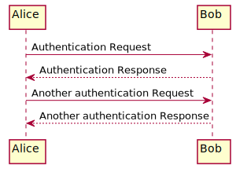

# PlantUML

PlantUML is a great library for creating diagrams that can be used for software design purposes. This document goes through the process of rendering these diagrams inside of a Markdown (`.md`) file.

The process for rendering the plantuml diagrams was acquired from [here](https://gist.github.com/noamtamim/f11982b28602bd7e604c233fbe9d910f).

## Local Rendering
This is the process I went through on Ubuntu 20.04 to get plantUML rendered using Visual Studio Code.

### Software Requirements

#### VS Code extensions:
- Markdown Preview Enhanced
- PlantUML

#### Install:
- Java: `sudo apt install default-jre`
- graphviz: `sudo apt install graphviz`

### Render
Create your plantuml diagram inside of a markdown `.md` file

Use `Markdown Preview Enhanced` to open the preview to the side. The button for this in VS Code is in the upper right side of the text editor window.

#### example PlantUML diagram:
````
```puml
@startuml
Alice -> Bob: Authentication Request
Bob --> Alice: Authentication Response

Alice -> Bob: Another authentication Request
Alice <-- Bob: Another authentication Response
@enduml
```
````

## Github Rendering

#### Install:
- PlantUML: `sudo apt-get install -y plantuml`

### Render
Create your plantuml diagram like you did before, but surround it with comments `<!--` & `-->`. This will cause your plantuml source text to not render in `Markdown Preview Enhanced` or in `Github`. For `Markdown Preview Enhanced`, your diagram will disappear.

You also need to add a title to your diagram. The title goes after the `@startuml` tag.

#### Example PlantUML diagram:
````
<!--
```puml
@startuml ExampleDiagram
Alice -> Bob: Authentication Request
Bob --> Alice: Authentication Response

Alice -> Bob: Another authentication Request
Alice <-- Bob: Another authentication Response
@enduml
```
-->
````

#### Generate Diagrams
Use PlantUML to generate the diagrams for your markdown file. PlantUML will ignore the comments you inserted in the above step.

Generate the diagrams using the `.svg` format, and place them in the directory `resources`.
`plantuml -tsvg -o resources FILENAME.md`

The example PlantUML diagram will be saved in `resources/ExampleDiagram.svg`.

#### Render generated Diagrams
Render your PlantUML diagram in your markdown file by referencing the generated file with the following syntax:
``

This will enable your diagram to be rendered using both `Markdown Preview Enhanced` and `Github`

#### Render in Github
When your markdown file is complete, commit both the markdown file and all related `.svg` files, and push them to your repository. When you open that file in github, all PlantUML diagrams should be rendered.

#### Rendered Example
Here's the example diagram, rendered.

